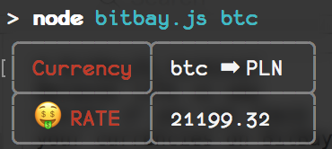

# BitBayJS_terminal
Because life is way easier if you can check your currencies on BitBay through terminal... 🙃

## HOW TO USE 🤔
In terminal type simply:
> node bitbay.js btc  
where argument is crypto currency which rate you are interested in.

output will be :

## TODO
- [ ] add support for other currencies not only PLN 🇵🇱 
- [x] error handling
- [ ] saving favorite currencies
- [x] displaying many currencies at once
- [ ] split script to smaller files
- [x] fix 'undefined' names of currencies in the generated table
